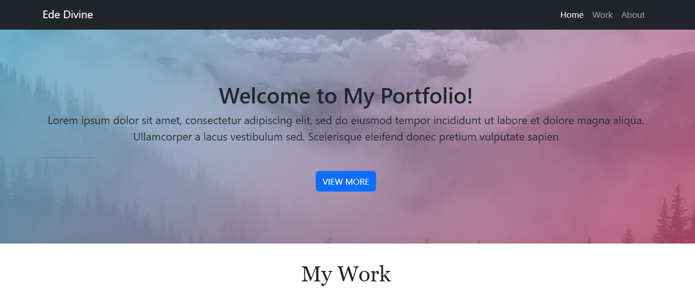

# Bootscrap-portfolio
​ In this project, I built a portfolio layout using the Bootstrap CSS Framework.

## Project Description

Using most things learnt about HTML, CSS, GitHub, GitHub Pages, and Bootstrap to create a portfolio website.

## How to Install and Run the Project

Download Zip file, unzip and open index.html file in browser

 ## How to Use the Project

To be used as a template to showcase portfolio of work to employers

 ## License

MIT License

 ## Resources
​
- [Bootstrap Documentation](https://getbootstrap.com/docs/5.3/getting-started/introduction/)
​
- [Responsive Web Design - How to Create Media Queries](https://www.youtube.com/watch?v=5xzaGSYd7jM)
​
- [Media Queries 101 by CSS Tricks](https://css-tricks.com/css-media-queries/)
​
- [Media Query Documentation](https://www.w3schools.com/css/css_rwd_mediaqueries.asp)
​
- [Github Pages Guide](https://pages.github.com/)

## Screenshot

## Deployed Application

https://divine2192.github.io/bootscrap-portfolio/

## Copyright
​
© 2023 edX Boot Camps LLC. Confidential and Proprietary. All Rights Reserved.